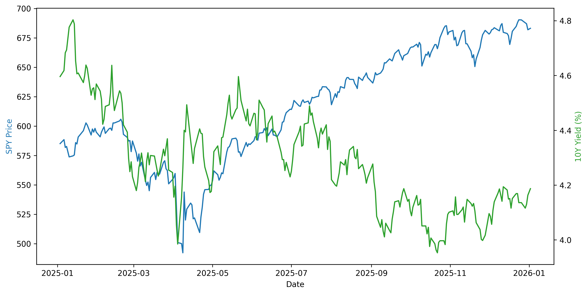

# 📉 我的跨資產數據分析 (Cross-Asset Analysis)

呢個係我第一個用 Python 同 GitHub 建立的數據庫。

### 📊 市場走勢圖 (Market Trends)
以下係標普 500、黃金同埋美國十年期債息的對比圖：

### 📋 學習筆記
* **數據來源**: Yahoo Finance
* **技術棧**: Python (yfinance, pandas, matplotlib)
* **分析邏輯**: 透過標準化 (Normalization) 對比唔同類別資產的表現。